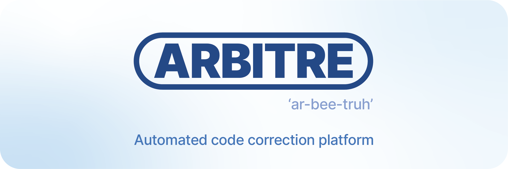

Arbitre allows computer science teachers to create and grade assignments for their students. Create exercises, share them with students, and view the results of automated testing in real time.

## Documentation 🧑‍💻

Learn how to use Arbitre or install it locally in the [Documentation](https://silicon-saver-c3d.notion.site/ARBITRE-Docs-0eda4df036504c5f98b1b7b14083f706).

## Features ✨

- Support for a wide range of programming languages
- Automated unit testing for fast, accurate grading
- Easy setup for teachers, with the option to self-host or have their organization host the application
- Secure storage of student solutions on a secure server, with code execution in an isolated virtual machine
- Modern, fast UI built with React and Django

## License 📖

Arbitre is licensed under the GPL 3.0 License. See [LICENSE](LICENSE) for more information.

## Credits 🙋‍♂️

Arbitre comes from [Télécom SudParis](https://www.telecom-sudparis.eu/), an engineering school based near Paris, France.
